## 服务器用户指南

## 更改记录
2026.03.19：服务器IP更改为：172.31.218.175
2026.04.22：服务器新增共享文件夹
2026.04.22：补充新购买服务器使用说明
### 一、服务器说明

> 目前实验室服务器配置有三张RTX8000显卡，配置了三个LXD虚拟化容器，详情如下
>
> <div>
>      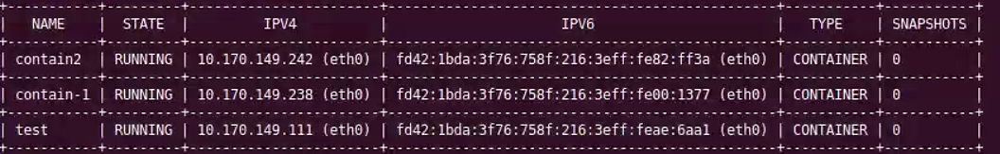
>     <p>容器配置详情</p>
> </div>
>
> 
>
> > [!warning]
> >
> > **目前容器未安装任何软件，如果使用容器，请在桌面新建txt文件，说明自己安装了哪些软件，配置了哪些环境**
>
> 
>
> 三个虚拟服务器远程连接所使用的端口号和密码信息在下表列出
>
> | NAME      | PORT                                            | PASSWORD |
> | --------- | ----------------------------------------------- | -------- |
> | test      | ssh: 60601<br />xrdp: 60611<br>Nomachie: 60621  | 2594     |
> | contain-1 | ssh: 60602<br />xrdp: 60612<br/>Nomachie: 60622 | 2594     |
> | contain2  | ssh：60603<br />xrdp：60613<br>Nomachie: 60623  | 2594     |
>
>   

### 二、服务器远程连接

#### 2.1、ssh连接

> 使用linux或windows终端（已经安装了ssh服务的情况下）
>
> ```bash
> #使用此命令连接，PORT换成你需要连接的容器的对应ssh端口号
> 
> ssh ubuntu@172.31.218.175 -p PORT
> 
> #按下回车后，第一次连接会提示一行信息，输入yes
> #提示输入密码
> #查看第一节中的表格，找到你需要连接的对应容器的密码
> ```
>
> 输入密码后进入对应容器的终端，如图
>
> <div> 
>     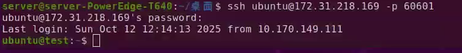
>     <p>进入虚拟服务器的终端</p>
> </div>

#### 2.2、xrdp连接

> 注意此连接方式只能使用Windows操作，连接质量最高，Ubuntu用户可使用[2.3](####2.3、使用Nomachine进行远程桌面连接)节提供的连接方案
>
> 使用Windows搜索并打开远程桌面连接，输入
>
> ```bash
> #将PORT换成你需要连接的容器对应xrdp端口号
> 172.31.218.175:PORT
> ```
>
> <div> 
>  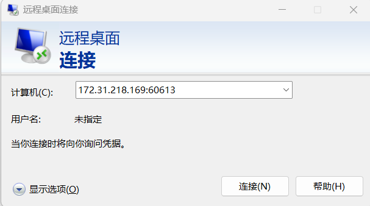
>  <p>如上图所示</p>
> </div>
>
> 之后进入登录界面，按照以下内容输入
>
> ```text
> username: ubuntu
> password: 表格中查找容器对应的密码
> ```
>
> <div> 
>  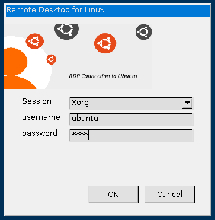
>  <p>如上图所示</p>
> </div>

#### 2.3、使用Nomachine进行远程桌面连接

> Nomachine是一个比较好用的远程桌面连接软件，支持虚拟桌面，所以可用在虚拟服务器上，下载地址：https://www.nomachine.com/
>
> Nomachie支持Windows和Linux，二者皆可使用，连接延迟低，画面质量高，比较推荐
>
> 安装Nomachine打开后
>
> <div> 
>  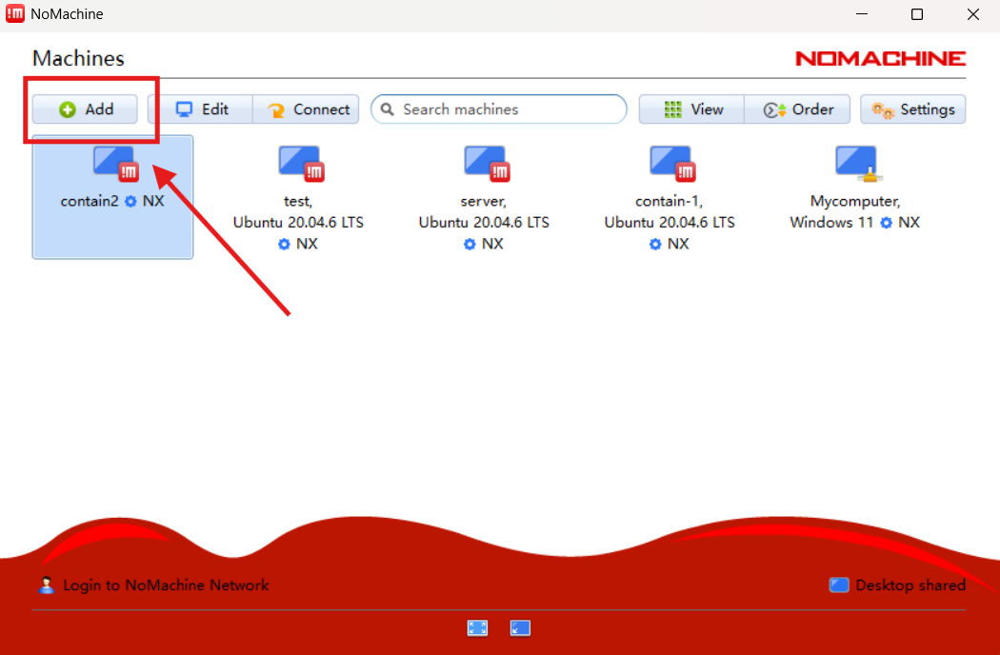
>  <p>点击add添加服务器</p>
> </div>
>
> <div> 
>  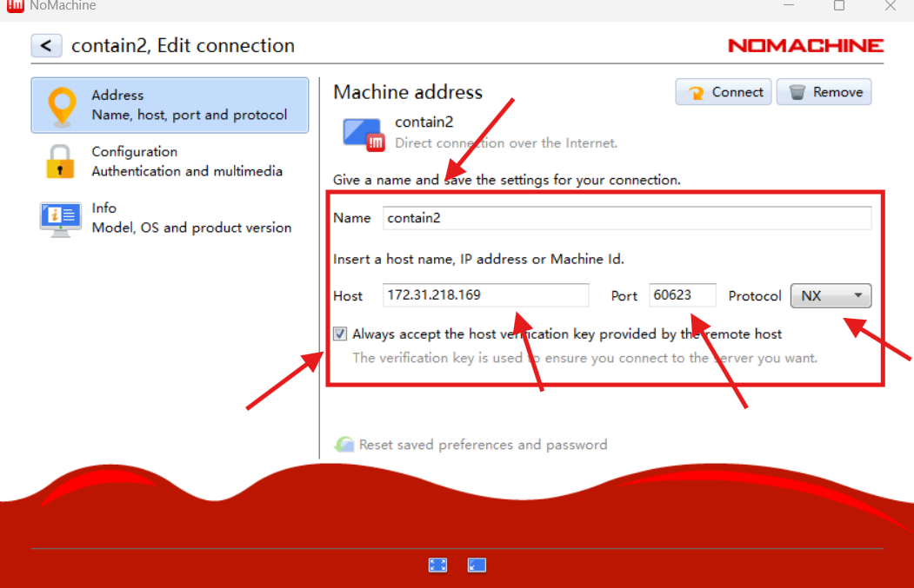
>  <p>name你可以自定义，自己记得是哪个容器即可</p>
>  <p>Host填如上主机IP，PORT填写配置表格中各个容器对应的nomachine端口号</p> 
>  <p>勾选 Always accept the host...</p>  
> </div>
>
> <div> 
>  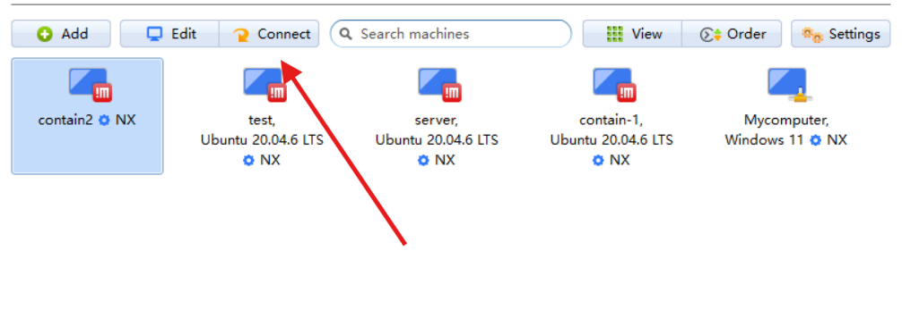
>  <p>可以右上角直接点击connect，或者返回进入图中界面</p>
>  <p>双击服务器图标0可以连接，或者选中后点击connect</p> 
> </div>
>
> <div> 
>  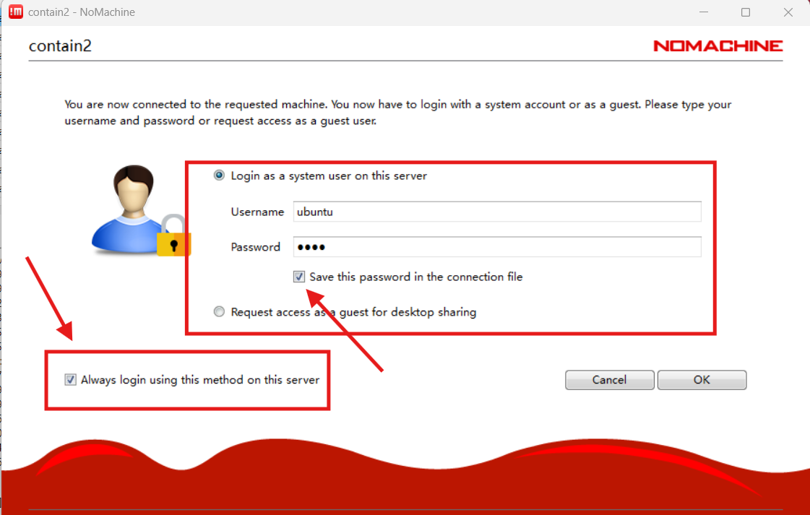
>  <p>第一次连接时按照图上输入虚拟服务器对应的username(ubuntu或者你自己创建的账号)和密码，并勾选保存</p>  
>  <p>按图上勾选后点击ok</p>
> </div>
>
> <div> 
>  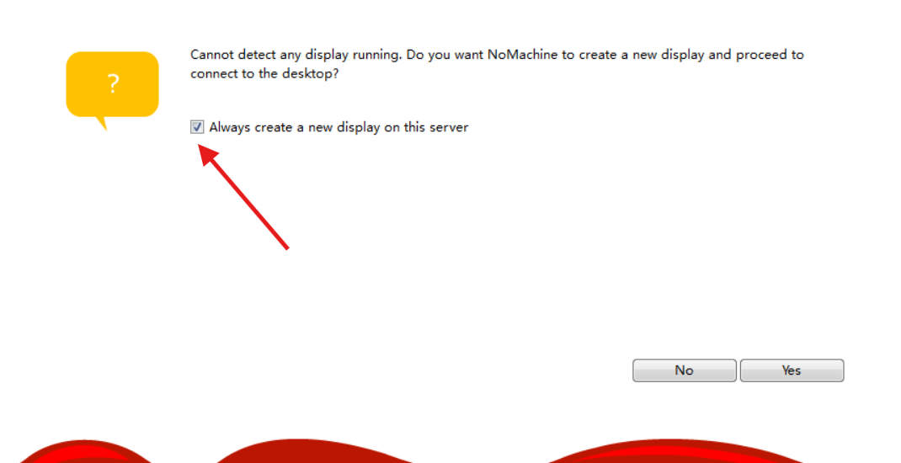
>  <p>勾选创建显示器，nomachine会为服务器创建虚拟显示器，你才可以使用桌面版ubuntu</p>
> </div>
>
> <div> 
>  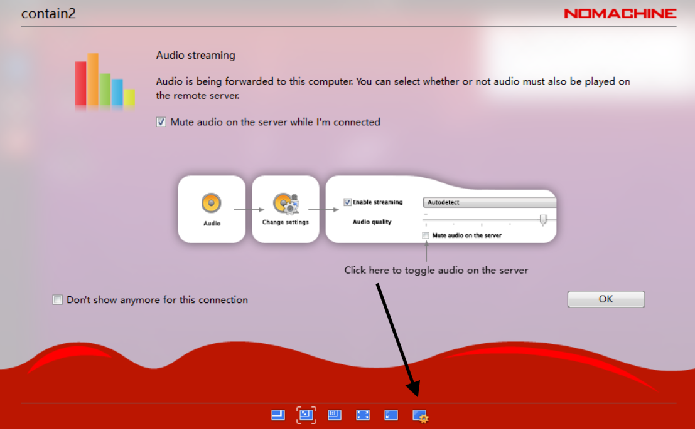
>  <p>这里可以设置虚拟显示器的参数，调整连接画面质量</p>
>     <p>后续全选ok即可（中间出现某些选项可以时虚拟显示器自适应你的屏幕，有时候会让画面清楚不少，有需要可以选一下）</p>
> </div>
>
> <div> 
>  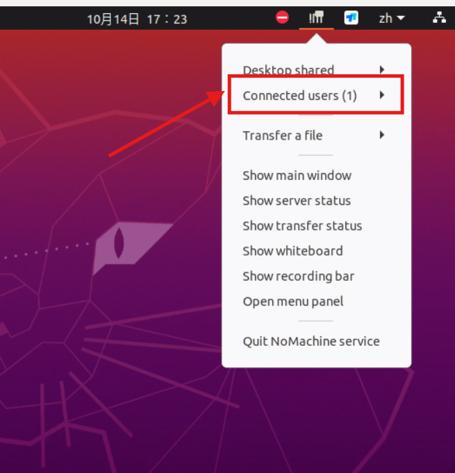
>  <p>连接成功后，这里可以查看当前有哪些人连接，避免冲突</p>
> </div>

### 三、文件传输

#### 3.1、使用scp进行文件传输

> 本地向服务器发送文件如下操作
>
> ```bash
> #将PORT换成虚拟机对应的ssh监听端口号，YOUR_FILE_PATH替换成你要发送的文件路径，传输位置为/tmp，此位置接收的文件有修改权限
> scp -P PORT YOUR_FILE_PATH ubuntu@172.31.218.175:/tmp
> ```
>
> 需要从服务器拷贝文件，顺序调换即可，例如
>
> ```bash
> #文件会从服务器的DEST_PATH下载至本地的YOUR_FILE_PATH
> scp -P PORT ubuntu@172.31.218.175:/DEST_PATH YOUR_FILE_PATH
> ```

#### 3.2、使用Nomachine进行文件传输

> 使用Nomachine连接到桌面可以直接在本地与服务器之间进行文件的拷贝与拖拽，简单便捷

### 四、注意

> * **ssh连接服务器使用只有命令行，xrdp和nomachine连接有桌面端**
> * **使用时一定要桌面新建txt说明安装了哪些软件，配置了哪些环境，方便别人使用和维护**
> * **虚拟机自带的账户名称是`ubuntu`如果有需要创建新账户，可以在对应容器内创建新账户，连接时需要将上述含有`ubuntu`用户名的操作替换成你创建的账户名，新账户装软件时不要安装在系统目录，应当安装在账户目录**
> * **为防止冲突，无论大家用哪种方式连接，连接时最好打开一个`ssh`连接，可以方便的使用`who`命令查看是否有别人在使用该容器**
>
>   ```bash
>   who  -q
>   ```
>
>   <div> 
>    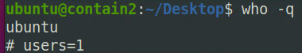
>    <p>此命令会向上面列举当前登录的用户，只有当你使用ssh远程连接的时候会+1，所以希望大家远程桌面连接的时候都能额外维持一个ssh连接</p>
>       <p>使用前先在ssh终端上查看是否有别人连接，能够很好地防止冲突</p>
>   </div>

### 五、服务器（172.31.218.175）新增共享文件说明
> 为了解决老服务器空间不足的问题，新增如下共享文件夹，可以使用宿主机空间，能够有效缓解空间不足问题。希望大家使用时也尽量将数据集文件放入该文件夹。
> <div> 
>    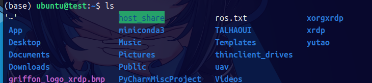
>   </div>
>
> 共享文件夹是`~/host_share`
>
## 新服务器使用说明
### 一、新服务器配置
> 新服务器有8台虚拟机可用，需要按需使用。GPU均为RTX4090 48GB版本。
> 
> | NAME | Number of gpus | ID of gpus | System Version |
> | ---- | -------------- |------------|----------------|
> | 100（2004ALL）    | 4  |   gpu0,gpu1,gpu2,gpu3,gpu4 | ubuntu20.04 |
> | 101（2404ALL）    | 4  |   gpu0,gpu1,gpu2,gpu3,gpu4 | ubuntu20.04 |
> | 102（2404G0）    | 1   |   gpu0 | ubuntu24.04 |
> | 103（2004G1）    | 1   |   gpu1 | ubuntu20.04 |
> | 104（2004G3）    | 1   |   gpu3 | ubuntu20.04 |
> | 105（2404G2）    | 1   |   gpu4 | ubuntu24.04 |
> | 106（2004G2G3）  | 2   |   gpu2,gpu3 | ubuntu20.04 |
> | 107（2404G0G1）  | 2   |   gpu0,gpu1 | ubuntu24.04 |
>
>服务器IP：172.31.218.176

### 二、新服务器连接方式
>新服务器只配置了`NoMachine`和`ssh`连接，连接方式和旧服务器相同，但使用方式有所区别。
#### 2.1、账号申请
>每个人使用之前请联系我申请一个使用账号，这是为了确保后续使用不冲突以及方便开关虚拟机。
#### 2.2、登录并开机
>申请到账号之后，浏览器访问：**https://172.31.218.176:8006**
>访问会报危险警告，无视即可。进入网站后会弹出登录界面，按如下选项登录：
><div> 
>    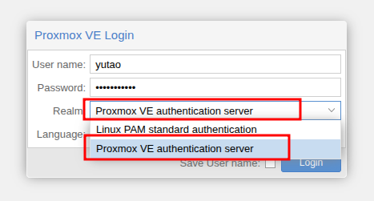
>   </div>
> 
> 账号和密码填入你找我申请的账号密码。
> 登录之后你可以看到八台虚拟机的状态，你可以选择你要用的虚拟机开机使用。
:::warning
一定注意！当你要用的虚拟机所配置的GPU被分配给了别的机器，并且那台机器处于开启状态，你不能打开你要用的那台机器，否则会出现占用问题。也就是说，同一个ID的GPU不能在多台机器上同时使用，当一个GPU已经被别人使用了之后，你只能寻找配置了没有被使用的GPU的虚拟机来用。
:::
><div> 
>    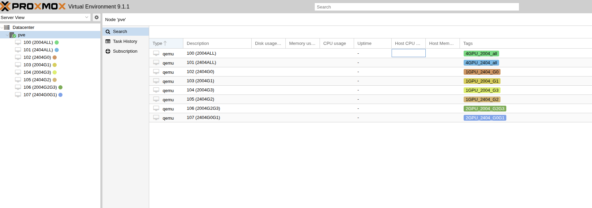
>   </div>
> 上面的图片即是登录之后的界面
>
> 按照如下步骤选择你需要使用的机器来开机
> <div> 
>    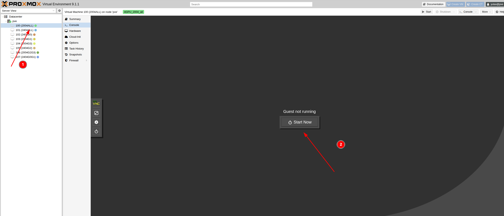
>   </div>
> 
> 开机之后你可以直接在这个网页上使用（但是不建议，因为这个界面画质高，带宽要求很高，用起来会很卡）
>
#### 2.3、web界面使用说明
><div> 
>    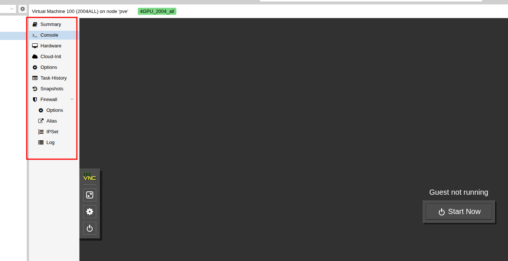
>   </div>
>
> 如上述图片所示
> * Summary:可以查看内存，cpu等使用情况
> * Console:可以查看图形化界面，开关机
>
### 三、NoMachine连接和ssh连接
>开机之后可以进行`Nomachine`和`ssh`连接
> `Nomachine`和`ssh`连接方式与老服务器相同，下表列出每台虚拟机对应的端口号
> | NAME | Nomachine Port | ssh Port | 
> | ---- | -------------- |------------|
> | 100（2004ALL）    | 60340 |   50322 | 
> | 101（2404ALL）    | 60240 |   50222 | 
> | 102（2404G0）    | 60440  |   50422 | 
> | 103（2004G1）    | 60540  |   50522 | 
> | 104（2004G3）    | 60640  |   50622 | 
> | 105（2404G2）    | 60740  |   50722 | 
> | 106（2004G2G3）  | 60940  |   50922 | 
> | 107（2404G0G1）  | 60840  |   50822 | 