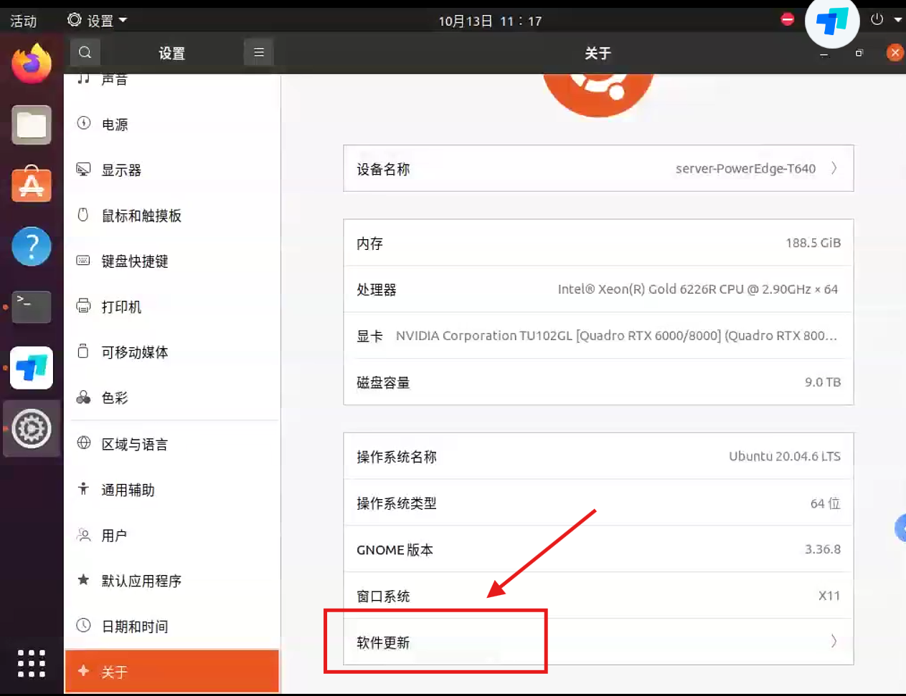
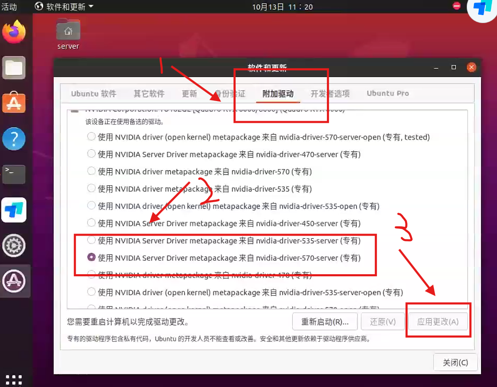
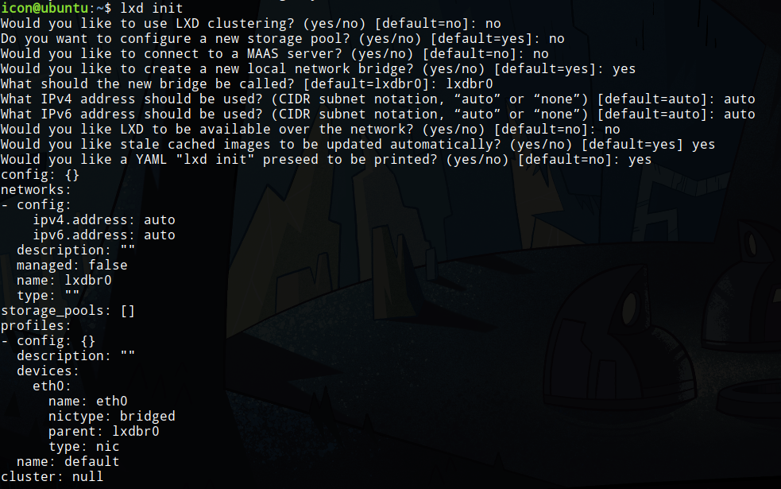
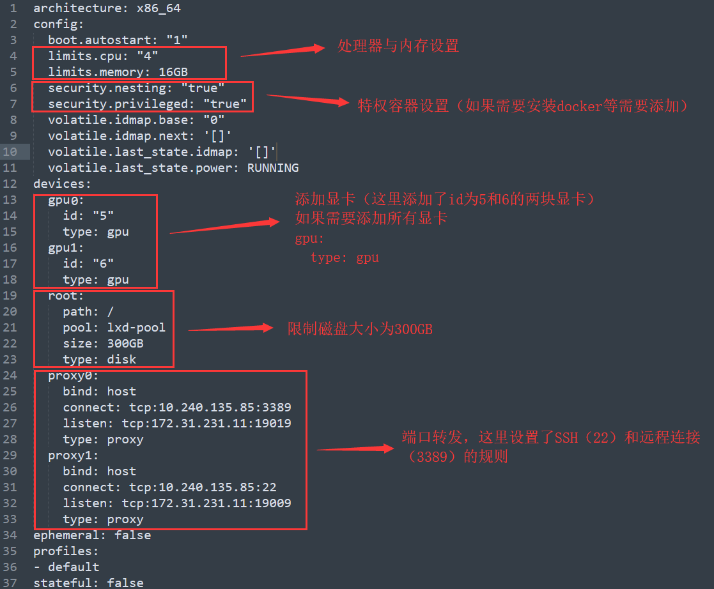
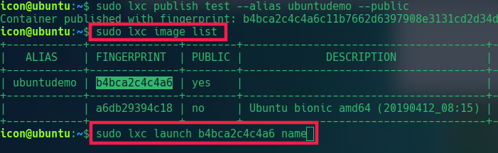

### 硬件状况

> GPU:RTX8000×3，显存48G
>
> 机械硬盘1：1T
>
> 机械硬盘2：8T（目前ubuntu安装盘）

### 配置过程

#### 1、网络配置

> * 服务器使用的是信息中心提供的固定ip，新系统安装之后把上网方式调成静态ip上网，静态ip配置信息如下
>
>   ```
>   IP:172.31.218.169
>   子网掩码：255.255.254.0
>   网关：172.31.218.1
>   DNS：192.168.247.6	//如果网页解析过慢，可以使用腾讯和阿里的DNS解析地址，网上都可以搜得到，一般学校的这个DNS解析地址也够用
>
> * 配置完成之后使用`ping`测试丢包率
>
>   ```bash
>   ping baidu.com
>   ```
>
>   如果丢包率不是0%，大概率ip有别人已经用了，出现冲突，换一个固定ip，最后一节＋1即可，如
>
>   ```text
>   IP：172.31.218.170
>   IP：172.31.218.171
>   ...
>   ```
>
>   直到丢包率为0%，说明ip正常，此时可以使用`todesk`和`ssh`正常连接服务器

#### 2、管理员账户

> 经过上述网络配置之后可以远程连接，主账户为`server`，后续会配置虚拟化
>
> * 账号，密码
>
>   ```text
>   账号：
>   密码：
>   ```
>
> * `ssh`连接
>
>   ```bash
>   ssh server@172.31.218.169
>   ```
>
> * `todesk`连接
>
>   ```text
>   设备代码：
>   安全密码：
>   ```

#### 3、LXD虚拟化

> 服务器已经进行LXD配置，以下配置过程遵循https://github.com/shenuiuin/LXD_GPU_SERVER

##### 3.1、宿主机安装

> * 选定某一Ubuntu版本进行安装，本次安装Ubuntu20.04
>
> * 安装完成后可直接在Ubuntu的软件安装与升级中进行显卡驱动安装
> 	<div>
> 		 
>    	 <p>选择软件更新</p>
>   </div>
>   <div>
> 		 
>    	 <p>选择对应驱动安装</p>
>   </div>

##### 3.2、lxd安装与初始化

> * 安装以下工具
>
>   ```bash
>   #lxd用于实现虚拟化
>   sudo apt install lxd
>   #zfs用于实现存储池，与lxd存储空间分配联动
>   sudo apt install zfsutils-linux
>   #网桥工具
>   sudo apt install bridge-utils
>   ```
>
> * 创建存储池与lxd初始化
>
>   > 选择一个物理硬盘，进行分区
>   >
>   > ```bash
>   > #本次配置由于宿主机在sdb中，选择未分区的sda创建存储池
>   > sudo fdisk /dev/sda
>   > #分区教程不再叙述，此次分区为sda1
>   > ```
>   >
>   > 创建存储池
>   >
>   > ```bash
>   > #在/sda1上创建存储池
>   > sudo lxc storage create NAME zfs source=/dev/sda1
>   > ```
>   >
>   > lxd初始化
>   >
>   > ```bash
>   > sudo lxd init
>   > ```
>   >
>   > <div>
>   >      
>   >  	 <p>存储池已经创建，所以选择no，其余选项按上述选择</p>
>   > </div>
>   >
>   > 配置完成后可以修改默认配置文件
>   >
>   > ```bash
>   > sudo lxc profile edit default
>   > ```

##### 3.3、容器创建

> * 使用清华镜像源创建Ubuntu容器
>
>   ```bash
>   #添加清华镜像源
>   sudo lxc remote add tuna-images https://mirrors.tuna.tsinghua.edu.cn/lxc-images/ --protocol=simplestreams --public
>   #列出可用镜像
>   sudo lxc image list tuna-images: 
>   #使用对应的ubuntu版本创建一个名为NAME的容器
>   sudo lxc launch tuna-images:ubuntu/focal NAME
>   ```
>
> * 现在容器是一个极简系统，对容器进行一些基本操作
>
>   ```bash
>   #进入容器终端，root用户
>   sudo lxc exec NAME bash
>   #设置root密码
>   passwd root
>   #容器自带一个用户，用户名ubuntu，同样设置个密码
>   passwd ubuntu
>   ```

##### 3.4、容器配置

> * 首先配置容器的远程连接，使用两种远程连接方式，ssh和xrdp远程桌面
>
>   > * 端口转发配置，远程连接通过端口转发功能实现，首先给容器配置端口
>   >
>   >   ```bash
>   >   #查看容器IP地址
>   >   sudo lxc list
>   >   #查看主机IP地址
>   >   ip addr
>   >   #配置端口转发,将HOST IP:PORT替换为主机ip和你想使用的端口，CONTAIN IP替换为容器ip
>   >   sudo lxc config device add test proxy0 proxy listen=tcp:HOST IP:YOUR PORT connect=tcp:CONTAIN IP:22 bind=host
>   >   sudo lxc config device add test proxy1 proxy listen=tcp:HOST IP:YOUR PORT connect=tcp:CONTAIN IP:3389 bind=host
>   >   #22端口为ssh端口，3389为xrdp端口，需要使用两个主机端口号进行监听
>   >   ```
>   >
>   > * 经上述配置后主机可以`ssh`直连了，下面配置xrdp桌面
>   >
>   >   ```bash
>   >   #首先给软件包换成国内源
>   >   #备份原来的源
>   >   sudo mv /etc/apt/sources.list /etc/apt/sources.list.bak
>   >   #修改源
>   >   sudo vim /etc/apt/sources.list
>   >   #此处可自行查找清华源或者阿里源更换
>   >   ##########
>   >   #更换之后
>   >   sudo apt install git
>   >   git clone https://github.com/shenuiuin/LXD_GPU_SERVER
>   >   cd LXD_GPU_SERVER/
>   >   sudo chmod a+x xrdp-installer-1.2.sh
>   >   mkdir -p ~/Downloads
>   >   ./xrdp-installer-1.2.sh
>   >   #使用上述脚本安装xrdp服务，以便可以使用windows远程桌面连接
>   >   ```
>
> * 容器安装显卡驱动
>
>   > 可以通过`xrdp`远程桌面连接后，通过与宿主机相同的方式安装，安装版本应该与宿主机保持一致
>
> * 容器配置文件修改
>
>   ```bash
>   #修改NAME容器配置指令
>   lxc config edit NAME
>   ```
>
>   <div>
>        
>    	 <p>配置文件含义说明</p>
>   </div>

##### 3.5、从模板新建容器

> 配置完成容器后可以保存为模板，直接从模板新建容器，新建后只需要修改配置文件即可
>
> ```bash
> #停止容器
> sudo lxc stop NAME
> #保存为镜像
> sudo lxc publish NAME --alias ubuntudemo --public
> #列出镜像
> sudo lxc image list
> ```
>
> <div>
>     
>  	 <p>按图操作，新容器名字为name</p>
> </div>

##### 3.6、常用管理操作

> ```bash
> #启动容器
> sudo lxc start NAME
> #停止容器
> sudo lxc stop NAME
> #列出容器
> sudo lxc list
> #列出啊存储池
> sudo zpool list
> #修改容器配置文件
> sudo lxc config edit NAME
> ```

### 实验室服务器LXD配置详情

> 目前配置了三台容器
>
> * 容器一
>
>   ```text
>   NAME:test
>   IP:10.170.149.111
>   config:
>   ## This is a YAML representation of the configuration.
>   ### Any line starting with a '# will be ignored.
>   ###
>   ### A sample configuration looks like:
>   ### name: instance1
>   ### profiles:
>   ### - default
>   ### config:
>   ###   volatile.eth0.hwaddr: 00:16:3e:e9:f8:7f
>   ### devices:
>   ###   homedir:
>   ###     path: /extra
>   ###     source: /home/user
>   ###     type: disk
>   ### ephemeral: false
>   ###
>   ### Note that the name is shown but cannot be changed
>   
>   architecture: x86_64
>   config:
>     boot.autostart: "1"
>     image.architecture: amd64
>     image.description: Ubuntu focal amd64 (20250628_07:42)
>     image.os: Ubuntu
>     image.release: focal
>     image.serial: "20250628_07:42"
>     image.type: squashfs
>     image.variant: default
>     limits.cpu: "4"
>     limits.memory: 32GB
>     security.nesting: "true"
>     security.privileged: "true"
>     volatile.base_image: b1afab006bbfc94942bbed929a76896ba8e7e7a45a0b86a54526f451d6ed7d52
>     volatile.eth0.host_name: vethcfe6385a
>     volatile.eth0.hwaddr: 00:16:3e:ae:6a:a1
>     volatile.idmap.base: "0"
>     volatile.idmap.current: '[]'
>     volatile.idmap.next: '[]'
>     volatile.last_state.idmap: '[]'
>     volatile.last_state.power: RUNNING
>     volatile.uuid: dedb8218-d585-4328-bf18-95587c804ebf
>   devices:
>     gpu0:
>       id: "0"
>       type: gpu
>     proxy0:
>       bind: host
>       connect: tcp:10.170.149.111:22
>       listen: tcp:172.31.218.169:60601
>       type: proxy
>     proxy1:
>       bind: host
>       connect: tcp:10.170.149.111:3389
>       listen: tcp:172.31.218.169:60611
>       type: proxy
>     proxy2:
>       bind: host
>       connect: tcp:10.170.149.111:4000
>       listen: tcp:172.31.218.169:60621
>       type: proxy
>     root:
>       path: /
>       pool: zfs-pool
>       size: 199GB
>       type: disk
>   ephemeral: false
>   profiles:
>   - default
>   stateful: false
>   description: ""
>   
>   ```
>
> * 容器二
>
>   ```text
>   NAME:contain-1
>   IP:10.170.149.238
>   config:
>   ## This is a YAML representation of the configuration.
>   ### Any line starting with a '# will be ignored.
>   ###
>   ### A sample configuration looks like:
>   ### name: instance1
>   ### profiles:
>   ### - default
>   ### config:
>   ###   volatile.eth0.hwaddr: 00:16:3e:e9:f8:7f
>   ### devices:
>   ###   homedir:
>   ###     path: /extra
>   ###     source: /home/user
>   ###     type: disk
>   ### ephemeral: false
>   ###
>   ### Note that the name is shown but cannot be changed
>   
>   architecture: x86_64
>   config:
>     boot.autostart: "1"
>     image.architecture: amd64
>     image.description: Ubuntu focal amd64 (20250628_07:42)
>     image.os: Ubuntu
>     image.release: focal
>     image.serial: "20250628_07:42"
>     image.type: squashfs
>     image.variant: default
>     limits.cpu: "4"
>     limits.memory: 32GB
>     security.nesting: "true"
>     security.privileged: "true"
>     volatile.base_image: b1afab006bbfc94942bbed929a76896ba8e7e7a45a0b86a54526f451d6ed7d52
>     volatile.eth0.host_name: vethcfe6385a
>     volatile.eth0.hwaddr: 00:16:3e:ae:6a:a1
>     volatile.idmap.base: "0"
>     volatile.idmap.current: '[]'
>     volatile.idmap.next: '[]'
>     volatile.last_state.idmap: '[]'
>     volatile.last_state.power: RUNNING
>     volatile.uuid: dedb8218-d585-4328-bf18-95587c804ebf
>   devices:
>     gpu0:
>       id: "1"
>       type: gpu
>     proxy0:
>       bind: host
>       connect: tcp:10.170.149.238:22
>       listen: tcp:172.31.218.169:60602
>       type: proxy
>     proxy1:
>       bind: host
>       connect: tcp:10.170.149.238:3389
>       listen: tcp:172.31.218.169:60612
>       type: proxy
>     proxy2:
>       bind: host
>       connect: tcp:10.170.149.238:4000
>       listen: tcp:172.31.218.169:60622
>       type: proxy
>     root:
>       path: /
>       pool: zfs-pool-1
>       size: 299GB
>       type: disk
>   ephemeral: false
>   profiles:
>   - default
>   stateful: false
>   description: ""
>   
>   ```
>
> * 容器三
>
>   ```
>   NAME:contain2
>   IP:10.170.149.242
>   config:
>   ## This is a YAML representation of the configuration.
>   ### Any line starting with a '# will be ignored.
>   ###
>   ### A sample configuration looks like:
>   ### name: instance1
>   ### profiles:
>   ### - default
>   ### config:
>   ###   volatile.eth0.hwaddr: 00:16:3e:e9:f8:7f
>   ### devices:
>   ###   homedir:
>   ###     path: /extra
>   ###     source: /home/user
>   ###     type: disk
>   ### ephemeral: false
>   ###
>   ### Note that the name is shown but cannot be changed
>   
>   architecture: x86_64
>   config:
>     boot.autostart: "1"
>     image.architecture: amd64
>     image.description: Ubuntu focal amd64 (20250628_07:42)
>     image.os: Ubuntu
>     image.release: focal
>     image.serial: "20250628_07:42"
>     image.type: squashfs
>     image.variant: default
>     limits.cpu: "4"
>     limits.memory: 32GB
>     security.nesting: "true"
>     security.privileged: "true"
>     volatile.base_image: b1afab006bbfc94942bbed929a76896ba8e7e7a45a0b86a54526f451d6ed7d52
>     volatile.eth0.host_name: vethcfe6385a
>     volatile.eth0.hwaddr: 00:16:3e:ae:6a:a1
>     volatile.idmap.base: "0"
>     volatile.idmap.current: '[]'
>     volatile.idmap.next: '[]'
>     volatile.last_state.idmap: '[]'
>     volatile.last_state.power: RUNNING
>     volatile.uuid: dedb8218-d585-4328-bf18-95587c804ebf
>   devices:
>     gpu0:
>       id: "2"
>       type: gpu
>     proxy0:
>       bind: host
>       connect: tcp:10.170.149.242:22
>       listen: tcp:172.31.218.169:60603
>       type: proxy
>     proxy1:
>       bind: host
>       connect: tcp:10.170.149.242:3389
>       listen: tcp:172.31.218.169:60613
>       type: proxy
>     proxy2:
>       bind: host
>       connect: tcp:10.170.149.242:4000
>       listen: tcp:172.31.218.169:60623
>       type: proxy
>     root:
>       path: /
>       pool: zfs-pool-2
>       size: 278GB
>       type: disk
>   ephemeral: false
>   profiles:
>   - default
>   stateful: false
>   description: ""
>   
>   ```
>
> 
>
> 
